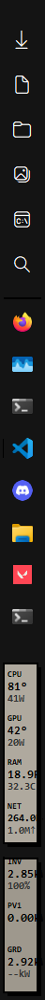

# quay

pronounced "key". A quay is a dock where things depart from, a place to put whatever you want

## Projects that are crucial for our script to work
- [[https://github.com/buliasz/AHKv2-Gdip]] ( credits)
- home assistant for pulling home stats ( optional)
- Libre Hardware Monitor to pull system stats
- Everything Search ( optional, crucial for me personally )

___
### more details in 
- [Documentation](https://github.com/SalarMohammadUzair/quay/blob/main/Documentation.md)

## For the Hardware stats to work, you must install Libre Hardware Montior and have it be running in the background all the time, it exposes a local web api that we pull the stats from. You can download it from [here](https://github.com/LibreHardwaRemonitor/LibreHardwareMonitor)
____
If you do not require Home assistant stats, you can toggle it off by setting ShowHomeAssistant to 0 in config.ini
___
### instructions on how to run
Download the repo, download and install libre hardware monitor ( the bar itself would work just fine wihout it, it just won't show the system stats), install AutoHotkey v2, double click the sidebar.ahk to run it.
You can tweak stuff from the config.ini, such as having it on the left or the right.
___
### demo
[Watch the demo video](Screenshot%202026-07-30%203654.mp4)
